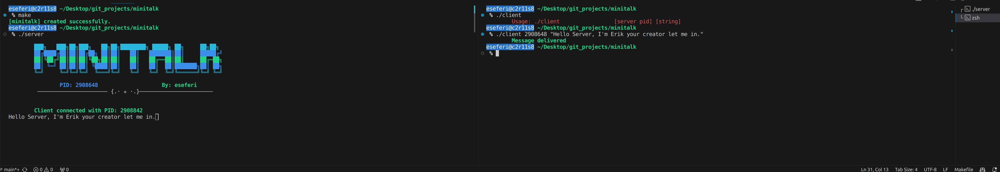

# MiniTalk

MiniTalk is a simple communication program implemented in C using the client-server model. It allows two processes to communicate with each other using signals. This project is part of the 42 Network curriculum.

## Table of Contents

- [Introduction](#introduction)
- [Usage](#usage)
- [Features](#features)
- [How it Works](#how-it-works)
- [File Structure](#file-structure)
- [Installation](#installation)
- [Contributing](#contributing)
- [License](#license)

## Introduction 

MiniTalk aims to establish a communication channel between a server and multiple clients using signals. The server listens for messages from clients and displays them, while clients can send messages to the server.

## Usage 

To use MiniTalk, follow these steps:

1. Compile the server and client programs.

    make

2. Run the server program on one terminal window.

    ./server

3. When you run the server it will show the pid of the server like below for example:

        ███╗   ███╗██╗███╗   ██╗██╗████████╗ █████╗ ██╗     ██╗██╗
        ██╔████╔██║██║██╔██╗ ██║██║   ██║   ███████║██║     █████╔╝ 
        ██║╚██╔╝██║██║██║╚██╗██║██║   ██║   ██╔══██║██║     ██╔═██╗ 
        ██║ ╚═╝ ██║██║██║ ╚████║██║   ██║   ██║  ██║███████╗██║ ██╗
        ╚═╝     ╚═╝╚═╝╚═╝  ╚═══╝╚═╝   ╚═╝   ╚═╝  ╚═╝╚══════╝╚═╝ ╚═╝

                PID: 2910136                    By: eseferi
         ────────────────────── {.⋅ ✯ ⋅.}───────────────────────

3. Run the client program on another terminal window.

    ./client <pid> <string>

    pid will be the server pid and string type anything you want and enter.

5. The server will receive the message and display it on the terminal.

6. The client will get a message saying Message delivered.

## Features 

- Simple client-server communication using signals.
- Ability to send and receive messages between the server and clients.
- Basic error handling for signal interruptions and message transmission failures.

## How it Works 

MiniTalk operates on the principle of inter-process communication (IPC) using signals. The server process listens for a specific signal from clients, while clients send signals containing messages to the server. Upon receiving a signal, the server decodes the message and displays it on the terminal.

## File Structure 

The project file structure is organized as follows:

- `src/`: Contains the source code files for the server and client programs.
- `inc/`: Includes header files used by the source code.
- `lib/`: Library providing formatted output functions.
- `Makefile`: Makefile for compiling the project.

## Installation 

To install MiniTalk, follow these steps:

1. Clone the repository: `git clone <repository_url> minitalk`
2. Navigate to the project directory: `cd minitalk`
3. Compile the project using the provided Makefile: `make`
4. Run the server program: `./server`
5. Run the client program: `./client`

## Contributing 

Contributions to MiniTalk are welcome! If you find any issues or have suggestions for improvements, please feel free to open an issue or create a pull request on GitHub.

## License 

MiniTalk is open-source software licensed under the [MIT License](LICENSE).
